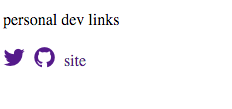

# ng2-personal-dev-links

A small component using Angular2 showing personal dev links

## Install

This is based on [ng2-play](https://github.com/pkozlowski-opensource/ng2-play) repo

Clone this repo and execute in your favourite shell:

* `npm i -g gulp` to install gulp globally (if you don't have it installed already)
* `npm i` to install local npm dependencies

## Play

After completing installation type in your favourite shell:

* `gulp play` to start a "Hello World" app in a new browser window. App files are observed and will be re-transpiled on each change.
